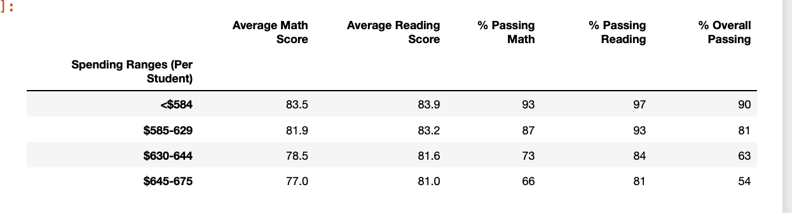
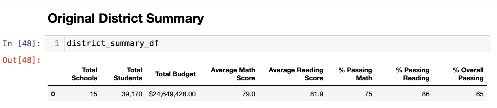
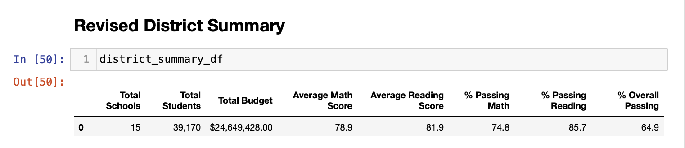

# School District Analysis  

## Overview of the school district analysis
We were tasked with analyzing if standardized testing were effective reviewing variables lke funding, school size, and other trends in school performance. This will inform the school board so they can make informed decisions about the schools and district overall. 

Data has been treated with the utmost confidentiality to protect the identity of the students. Except where we put it all on the internet, I suppose.

There were issues with the data from Thomas High School's 9th grade class; that data specific to reading and math scores was replaced with NaN, and the analysis for the school, and the district, were revised to account for that change.

## Results
The original analysis of the 15 high schools in the district showed that:
* The top five schools based on overall passing percent were Cabrera, Thomas, Griffin, Wilson and Pena respectively. Cabrera topped the overall passing percent with a 91.3%.
* The bottom five schools also based on overall passing percent were Rodriguez, Figueroa, Huang, Hernandez and Johnson, with Johnson being last at just 53.4%.
* Cabrera, a charter school with 1858 students total, has a per student budget of $582 - which puts them in the lowest bracket for spending per student.
* Johnson, a district school, has 4761 students and spends, peer student $650 - putting them in the group with the highest spending per student.
* In fact, the most successful spending range of a school in this district looking att the percent overall passing was the group that spend less than $584 per student, averaging 90% overall passing.
* The size of the school was also measured for scores and passing percentages, and there was a clear correlation betweeen small schools (under 1000 students) and hteeir success in scores and perecent passing math and reading compared to the large schools (2000-5000).

### Spending ranges

### Changes after the revision
* The district summary changed in that the average scores and percentt passing dropped slightly. Average reading score was not affected by thet revision/removal of thee 9th grade Thomas High School student data.
* The school summary was mostly unchanged, with the exception of the scores and percent passing rates for reading, math, and overall which went up after the data was revised.
* In both the original and revised analysis, Thomas High School was in the top five performing schools in the district, behind only Cabrera High School. 
* Revision affects to the following areas:
* Math and reading scores by grade: 
* Thomas High School had originally averaged 83.59 in math scores for 9th grade, and 83.83 in average reading scores. After the 9th grade data was removed, the average math and average reading scores remained very much the same. Average math score for Thomas after revision was 83.35, slightly lower than before. The average reading score for Thomas after revision was 83.89, slightly higher than before. 
* Scores by school spending: There was no significant change to the information overall with the removal of the 9th grade Thomas High School data.
* Scores by school size: Scores by school size did not reveal any significant changes when the data from Thomas High School was removed.
* Scores by school type: Charter schools, including Thomas High School, changed only very slightly after the revision - rounding out the data during formatting shows no significant change, as the final percentages for passing overall, passing math, passing reading, and even the scores for average math and reading are unchanged.

## Summary
The updated school district analysis where reading and math scores for the ninth grade at Thomas High School have been replaced with NaNs resulted in a higher average math score, average reading score, passing math percentage, passing reading percentage, and overall passing percentage for Thomas High School. While some of the data was replaced, others such as the student IDs, school type, school size and spending range per student were not affected, and did not change. Since the change was made to one grade in one school, the impact to the district was not dramatic, but it is important that the school board have accurate data with which to make their decisions - both about handling misinformation reported on stardardized testing, and in improving schools for our children.
